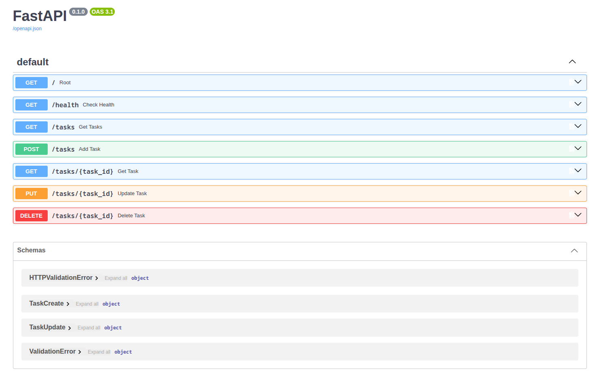

# Task CRUD API

A small in-memory Task management API built with FastAPI. Supports full CRUD
(Create, Read, Update, Delete) over a `tasks` list, with request validation
and interactive Swagger UI documentation.

## Install & Run

```bash
pip install -r requirements.txt && uvicorn main:app --reload
```

The API will be available at `http://127.0.0.1:8000`, and interactive docs
(Swagger UI) at `http://127.0.0.1:8000/docs`.

## Endpoints

| Method | Path            | Description                        | Success | Error(s)                                  |
|--------|-----------------|-------------------------------------|---------|--------------------------------------------|
| GET    | `/`             | API metadata                        | 200     | —                                          |
| GET    | `/health`       | Health check                        | 200     | —                                          |
| GET    | `/tasks`        | List all tasks                      | 200     | —                                          |
| GET    | `/tasks/{id}`   | Retrieve a single task by ID        | 200     | 404 if not found                           |
| POST   | `/tasks`        | Create a new task (body: `title`)   | 201     | 400 if empty                               |
| PUT    | `/tasks/{id}`   | Update a task's `title` and/or `done` | 200   | 400 if empty body, 404 if not found        |
| DELETE | `/tasks/{id}`   | Delete a task by ID                 | 204     | 404 if not found                           |

## Example Request

```
$ curl -i http://127.0.0.1:8000/tasks
HTTP/1.1 200 OK
date: Fri, 04 Sep 2026 12:53:21 GMT
server: uvicorn
content-length: 136
content-type: application/json

[{"id":1,"title":"Complete report","done":false},{"id":2,"title":"Send email","done":false},{"id":3,"title":"Review code","done":false}]
```

## Swagger UI



