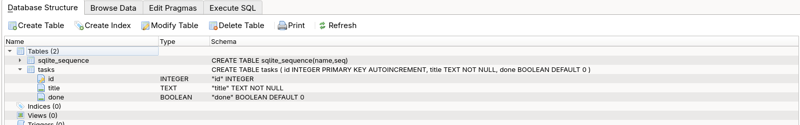
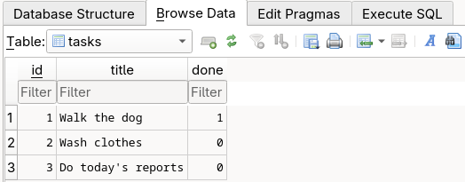

# Task CRUD API

A small Task management API built with FastAPI, persisted to a local SQLite
database. Supports full CRUD (Create, Read, Update, Delete) over a `tasks`
table, with request validation and interactive Swagger UI documentation.

## Install & Run

```bash
pip install -r requirements.txt && uvicorn main:app --reload
```

That's the one command you need. On startup the app creates `tasks.db`
automatically (if it doesn't already exist), creates the `tasks` table, and
seeds it with three example tasks. No manual database setup required.

The API will be available at `http://127.0.0.1:8000`, and interactive docs
(Swagger UI) at `http://127.0.0.1:8000/docs`.

## Database

**Why SQLite?** It's a single file with zero setup — no server process to
install, configure, or run alongside the app. It ships with Python
(`sqlite3` is in the standard library), and data survives restarts since
everything is written to disk instead of an in-memory list.

**Where it lives:** the database file is `tasks.db`, created automatically
in the project directory the first time the app starts (see `init_db()` in
`main.py`). It's git-ignored (see the repo's `.gitignore`), so a fresh clone
starts with no database file — running the app is what creates it and seeds
the three example tasks.

### Schema

```sql
CREATE TABLE tasks (
    id INTEGER PRIMARY KEY AUTOINCREMENT,
    title TEXT NOT NULL,
    done BOOLEAN DEFAULT 0
)
```





### Example SQL query

While exploring the seeded data in DB Browser's "Execute SQL" tab:

```sql
SELECT * FROM tasks WHERE done = 1;
```

## Endpoints

| Method | Path            | Description                        | Success | Error(s)                                  |
|--------|-----------------|-------------------------------------|---------|--------------------------------------------|
| GET    | `/`             | API metadata                        | 200     | —                                          |
| GET    | `/health`       | Health check                        | 200     | —                                          |
| GET    | `/tasks`        | List all tasks                      | 200     | —                                          |
| GET    | `/tasks/{id}`   | Retrieve a single task by ID        | 200     | 404 if not found                           |
| POST   | `/tasks`        | Create a new task (body: `title`)   | 201     | 400 if empty                               |
| PUT    | `/tasks/{id}`   | Update a task's `title` and/or `done` | 200   | 400 if empty body, 404 if not found        |
| DELETE | `/tasks/{id}`   | Delete a task by ID                 | 204     | 404 if not found                           |

## Example Request

```
$ curl -i http://127.0.0.1:8000/tasks
HTTP/1.1 200 OK
date: Fri, 04 Sep 2026 12:53:21 GMT
server: uvicorn
content-length: 136
content-type: application/json

[{"id":1,"title":"Walk the dog","done":true},{"id":2,"title":"Wash clothes","done":false},{"id":3,"title":"Do today's reports","done":false}]
```
